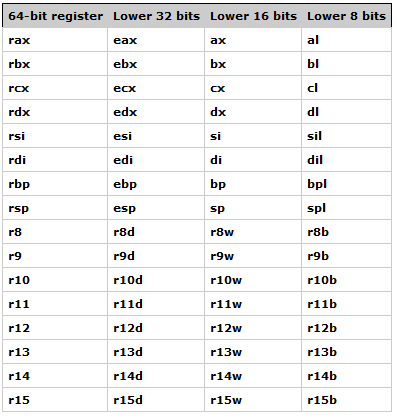

# **Chapter 3: PWN/Binary Exploitation**

## Introduction

Code can be compiled into binaries and executables. Some of these binaries can be exploited to gain access to the system. This is called binary exploitation or pwn. This chapter will cover the basics of binary exploitation and how to use tools such as pwntools to exploit binaries.

This is a great introductory [guide](https://blog.caprinux.com/lawofpwn/) and it it recommended to read it along with this chapter.
Some great tools for pwn are [pwninit](https://github.com/io12/pwninit), [pwntools](https://github.com/Gallopsled/pwntools), [gdb](https://www.sourceware.org/gdb/) + [gef](https://github.com/hugsy/gef), [IDA Pro](https://hex-rays.com/ida-pro/) and [Ghidra](https://ghidra-sre.org/).

## Memory Management

A lot of Binary exploitation are related to memory management. Thus, it is important to understand some basics of memory management.

### Registers

In a computer, registers are small storage areas that are built into the CPU and are used to hold data that the CPU is currently working on. Registers are used to store a variety of information, including instruction codes, data values, and memory addresses, much like RAM. Unlike RAM however, accesses to registers are effectively instantaneous, whereas reads from main memory can take hundreds of CPU cycles to return. This makes registers much faster than RAM, but they are also much smaller and can only hold a small amount of data. Here is a brief overview of the x86-64 registers:

1. General-purpose registers: There are 16 general-purpose registers in the x86-64 architecture, which are used to hold data values and memory addresses. These registers are named `rax`, `rbx`, `rcx`, `rdx`, `rsi`, `rdi`, `rbp`, `rsp`, `r8`, `r9`, `r10`, `r11`, `r12`, `r13`, `r14`, and `r15` which are 64 bit registers, with `eax` (holds the return value of a function), `ebx`, `ecx`, `edx`, `esi`, `edi`, `ebp`, `esp`, `r8d`, `r9d`, `r10d`, `r11d`, `r12d`, `r13d`, `r14d`, and `r15d`.
2. Instruction pointer: The instruction pointer (also known as the program counter) is a register that holds the memory address of the next instruction that the CPU will execute. It is named RIP in the x86-64 architecture.
3. Flag registers: There are several flag registers in the x86-64 architecture, which are used to store information about the current state of the CPU. These registers include the carry flag, the zero flag, the sign flag, and the overflow flag.
4. Segment registers: The x86-64 architecture includes six segment registers, which are used to store memory addresses and to control the way that the CPU accesses memory. These registers are named CS, DS, ES, FS, GS, and SS.

### Program Stack

A program stack is a data structure that is used by a computer program to store temporary data during the execution of the program. It is called a "stack" because it operates on the principle of Last In First Out (LIFO), which means that the last item added to the stack will be the first one to be removed. In a program, the stack is used to store a variety of information, such as function arguments, local variables, and return addresses. When a program calls a function, the function's arguments and local variables are pushed onto the stack, and when the function returns, the return value and the previous state of the program are popped off the stack. The `esp`/`rsp` register holds the address in memory where the bottom of the stack resides. This is a great [resource](https://ctf101.org/binary-exploitation/what-is-the-stack/) to learn more about the stack.

### Buffer

A buffer is a region of memory used to hold data temporarily while it is moved from one location to another. Typically, the data is stored in a buffer as it is retrieved from an input device or just before it is sent to an output device . However, a buffer may be used when moving data between processes within a computer. It acts some what like a cache. Note that the stack grows downwards, towards lower memory addresses, but the buffer is written upwards, towards higher memory addresses.

## Buffer Overflow

A buffer overflow is an anomaly that occurs when a program, while writing data to a buffer, overruns the buffer's boundary and overwrites adjacent memory locations. This can cause the program to crash, or, in the case of a buffer overflow vulnerability, it can be exploited to overwrite critical program data.

It is recommended and beneficial to read this great [writeup](https://enscribe.dev/ctfs/pico22/pwn/buffer-overflow-series/) for picoCTF questions Buffer Overflow 0 and Buffer Overflow 1 to learn how to perform a buffer overflow and understand the theory behind it. It also gives a small introduction on how to use pwntools.

These are some great resources to learn more about buffer overflow:

* [Understanding Buffer Overflow](https://medium.com/techloop/understanding-buffer-overflow-vulnerability-85ac22ec8cd3)
* [Complete Guide to Buffer Overflow](https://steflan-security.com/complete-guide-to-stack-buffer-overflow-oscp/)
* [CTF101: Buffer Overflow](https://ctf101.org/binary-exploitation/buffer-overflow/)
* [Linux Stack Based Buffer Overflow](https://www.exploit-db.com/docs/english/28475-linux-stack-based-buffer-overflows.pdf)
* [Buffer Overflows Made Easy (Video)](https://www.youtube.com/watch?v=ncBblM920jw)

## PWNTools

Pwntools is a Python library that is designed to make it easier to work with low-level network protocols and to perform tasks related to exploit development and reverse engineering. Pwntools provides a set of libraries and utilities that can be used to build and test exploits, as well as to communicate with remote servers and services.
Some good resources to learn Pwntools are:

* [Pwntools (Video)](https://www.youtube.com/watch?v=9wepzpQhhio)
* [Pwntools Intro](https://guyinatuxedo.github.io/02-intro_tooling/pwntools/index.html)
* [Pwntools Step by Step](https://laptrinhx.com/learn-pwntools-step-by-step-3291757783/)
* [Pwntools Tutorial](https://github.com/Gallopsled/pwntools-tutorial)
* [Pwntools Walkthrough (Video)](https://www.youtube.com/watch?v=vwLA4nhvLJg)
* [Pwntools Documentation Book](https://buildmedia.readthedocs.org/media/pdf/pwntools/stable/pwntools.pdf)
* [Pwntools Documentation Website](https://docs.pwntools.com/en/stable/)
* [Pwntools HackTricks](https://book.hacktricks.xyz/reversing-and-exploiting/tools/pwntools)
* [Pwndbg](https://github.com/pwndbg/pwndbg)

## Questions

Go to these sites and try some questions. Do not be discouraged if you cannot solve them, as it is a learning process. If you do not understand something, such as what is cuRL, do not be afraid to google and learn new things. If you are stuck, try to look as the hints, but even after that you are still stuck, search online for writeups for the problem. [This](https://www.hackthebox.com/blog/It-is-Okay-to-Use-Writeups) is a good article on why it is okay to use writeups.

* [PicoGym Binary Exploitation](https://play.picoctf.org/practice?category=6&page=1)
* [pwnable.xyz](https://pwnable.xyz/challenges/)
* [pwnable.tw](https://pwnable.tw/)
* [OverTheWire Narnia](https://overthewire.org/wargames/narnia/)
* [pwn.college](https://dojo.pwn.college/)
* [W3Challs](https://w3challs.com/challenges/list/pwn)
* [Pheonix](https://exploit-exercises.com/phoenix/)
* [Microcorruption](https://microcorruption.com)

## Additional Resources

* [Modern Binary Exploitation Course](https://github.com/RPISEC/MBE)
* [Exploiting Binaries Lecture](https://trailofbits.github.io/ctf/exploits/binary1.html)
* [How2Heap](https://github.com/shellphish/how2heap)
* [Insecuse Smash Stack](https://insecure.org/stf/smashstack.html)
* [Binary Analysis for Python](https://angr.io/)
* [LiveOverflow Binary Expoitation Playlist](https://www.youtube.com/watch?v=iyAyN3GFM7A&list=PLhixgUqwRTjxglIswKp9mpkfPNfHkzyeN)
* [Pwntools Cheatsheet](https://gist.github.com/anvbis/64907e4f90974c4bdd930baeb705dedf)
* [wechall.net](https://www.wechall.net/active_sites)
* [wechall challenges](https://www.wechall.net/challs/)
