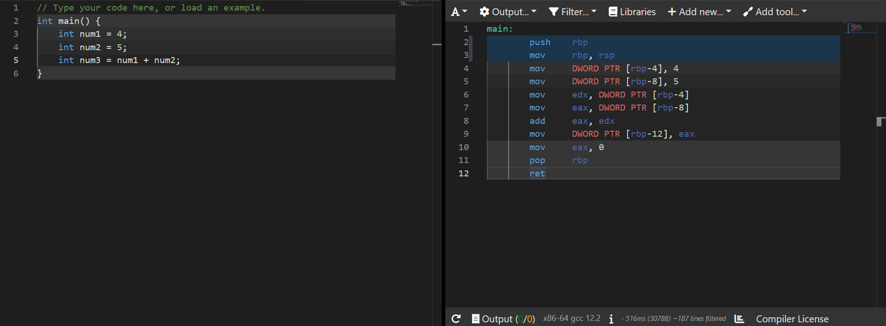
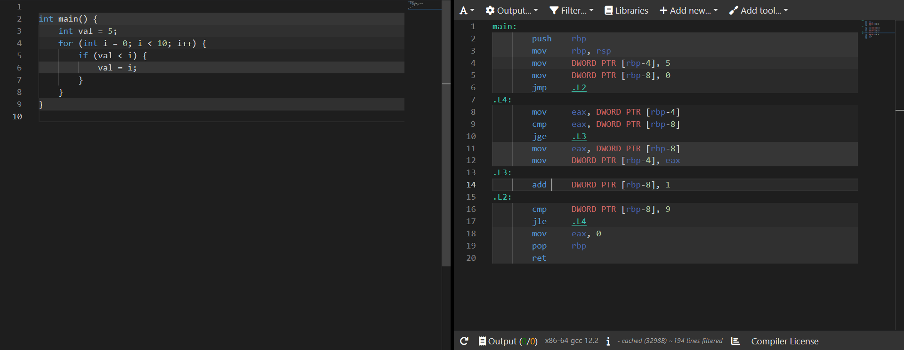

# **Chapter 2: Simple Reverse Engineering**

## Introduction

Most code are compiled via a compiler from a high level language, such as Java, to a low level language, such as C, to create an executable. But what if you are given a buggy executable? Reverse engineering is the process of taking a binary executable and trying to understand what it does and thus how to exploit it. This can be done by many ways, such as using a debugger, disassembling the executable, or using a decompiler. This chapter will go through the basics of reverse engineering.

## Disassembler

A [disassembler](https://ctf101.org/reverse-engineering/what-are-disassemblers/) is a computer program that converts machine language into assembly language, which can allow us to possibly understand what the program does. There are many disassemblers, such as [IDA Pro](https://hex-rays.com/ida-pro/), [Ghidra](https://ghidra-sre.org/), [Radare2](https://rada.re/n/), [Cutter](https://cutter.re/) and [Binary Ninja](https://binary.ninja/). However, to use a disassembler, we first need to know some assembly.

[//]: # (Probably could use the cracked IDA Pro link)

## Assembly

Assembly language is a low-level programming language that is used to write instructions for a computer's processor. It is a symbolic representation of machine code, which consists of a series of binary digits that the processor can understand and execute. Each assembly instruction corresponds to a specific machine code instruction, so when an assembly program is compiled, the assembly instructions are translated into machine code that the processor can execute. We will be going through x86-64 assembly, which is the most common assembly language used in modern computers.

We will see some Assembly intructions for some simple code, which is written in C++ (should be similar to Java). However, before going through the examples, we should go through some memory management basics.

### Program Stack

A program stack is a data structure that is used by a computer program to store temporary data during the execution of the program. It is called a "stack" because it operates on the principle of Last In First Out (LIFO), which means that the last item added to the stack will be the first one to be removed.
In a program, the stack is used to store a variety of information, such as function arguments, local variables, and return addresses. When a program calls a function, the function's arguments and local variables are pushed onto the stack, and when the function returns, the return value and the previous state of the program are popped off the stack.
The stack is an important part of a computer's memory management system, as it allows a program to store and retrieve data in a very efficient way.

### Base Pointer

The base pointer  is a special pointer that points to the base of the current stack frame. A stack frame is a section of the program stack that is used to store data for a specific function or procedure.

The base pointer is used to keep track of the current position in the stack, and it is typically used to access the data stored in the stack frame. It is often used in conjunction with other pointers, such as the stack pointer and the instruction pointer, to control the flow of a program and to access data in the stack.

The base pointer is typically set to the address of the bottom of the current stack frame when a function is called, and it is adjusted as the function pushes and pops data onto and off of the stack. It is also used to keep track of the location of local variables and function arguments within the stack frame, which makes it easier for the program to access this data.

### Simple Addition

This is a simple program that initialise three integers, the first one storing the value 4, the second storing the value 5, and the final one storing the addition of the other two integers.

1. `push rbp`: This instruction pushes the current value of the base pointer (`rbp`) onto the stack. The stack is a data structure that is used to store data temporarily while a program is running. The base pointer is a register that is used to store the address of the current stack frame, which is LIFO (Last In First Out). A stack frame is a portion of the stack that is dedicated to a particular function (a block of code that performs a specific task).
2. `mov rbp, rsp`: This instruction moves the value of the stack pointer (`rsp`) into the base pointer (`rbp`). The stack pointer is a register that points to the top of the stack. This instruction is typically used at the beginning of a function to set up a newstack frame.
3. `mov DWORD PTR [rbp-4], 4`: This instruction stores the value 4 in the memory location pointed to by the base pointer minus 4 bytes. The square brackets around `rbp-4` indicate that this is a memory location, which is 4 bytes before a base pointer and the `DWORD PTR` prefix indicates that the value being stored is a 32-bit integer. This memory location is being used as a local variable in the function. A local variable is atype of variable that is only accessible within the function in which it is defined.
4. `mov DWORD PTR [rbp-8], 5`: This instruction stores the value 5 in the memory location pointed to by the base pointer minus 8 bytes. This memory location is also being used as a local variable in the function.
5. `mov edx, DWORD PTR [rbp-4]`: This instruction loads the value stored in the memory location pointed to by the base pointer minus 4 bytes into the register `edx`. Registers are locations in the CPU where data can be stored and manipulated quickly. `edx` is a 32-bit register.
6. `mov eax, DWORD PTR [rbp-8]`: This instruction loads the value stored in the memory location pointed to by the base pointer minus 8 bytes into the register `eax`. `eax` is a 32-bit register and normally where the return value of a function is contained.
7. `add eax, edx`: This instruction adds the values stored in the registers `eax` and `edx` and stores the result in `eax`.
8. `mov DWORD PTR [rbp-12], eax`: This instruction stores the value in the register `eax` in the memory location pointed to by the basepointer minus 12 bytes. This memory location is being used as a local variable in the function.
9. `mov eax, 0`: This instruction stores the value 0 in the register `eax`. This value is the value that will be returned by the function.
10. `pop rbp`: This instruction removes the value at the top of the stack and stores it in the base pointer (`rbp`). This instruction is typically used at the end of a function to restore the previous stack frame.
11. `ret`: This instruction returns control to the caller of the function.

### Simple Loop and Comparison

This is a simple program that initialise two integers, `i` as the counter and `val` contains the value 5. The programs loops through 0 to 9, and when `i` is bigger than `val`, `val` will be updated to the value of `i`.

1. `push rbp`: This instruction pushes the current value of the base pointer (`rbp`) onto the stack.
2. `mov rbp, rsp`: This instruction moves the value of the stack pointer (`rsp`) into the base pointer (`rbp`). The stack pointer is a register that points to the top of the stack.
3. `mov DWORD PTR [rbp-4], 5`: This instruction stores the value 5 in the memory location pointed to by the base pointer minus 4 bytes. The square brackets around `rbp-4` indicate that this is a memory location, and the `DWORD PTR` prefix indicates that the value being stored is a 32-bit integer. This memory location is being used as a local variable in the function.
4. `mov DWORD PTR [rbp-8], 0`: This instruction stores the value 0 in the memory location pointed to by the base pointer minus 8 bytes. This memory location is also being used as a local variable in the function and will be updated in the for loop.
5. `jmp .L2` performs an unconditional jump to the label `.L2`. This jumps to the start of the loop.
6. `.L4:` is a label, which marks the start of a block of code that can be jumped to.
7. `mov eax, DWORD PTR [rbp-8]`: This instruction loads the value stored in the memory location pointed to by the base pointer minus 8 bytes into the register `eax`.
8. `cmp eax, DWORD PTR [rbp-8]`: This intruction compares the value in the register `eax` with the value at the memory location `rbp-8`. This sets the status flags based on the result of the comparison. The status flags are used to determine the result of conditional jumps. `cmp` is done by subtracting one operand from the other for comparing whether the operands are equal or not. It does not disturb the destination or source operands. The result of the comparison is stored in the status flags. The most important of these flags are the `ZF` (Zero Flag) and `SF` (Sign Flag). The `ZF` flag is set to 1 if the result of the comparison is 0, and the `SF` flag is set to 1 if the result of the comparison is negative.
9. `jge .L3`:   `jge` means `jump greater than or equal to`. This instruction performs a jump to the label `.L3` if the value in the register `eax` is greater than or equal to the value at the memory location `rbp-8`. If the condition is not met, execution continues to the next line.
10. `mov eax, DWORD PTR [rbp-8]`: This instruction loads the value stored in the memory location pointed to by the base pointer minus 8 bytes into the register `eax`. Thus updating the value of `eax` to the value of `rbp-8`.
11. `mov DWORD PTR [rbp-4], eax`: This instruction loads the value stored in the memory location pointed to by the register `eax` into `rbp-4`, updating the value of the variable.
12. `.L3`: This is a label, which marks the start of the block of code that can be jumped to.
13. `add DWORD PTR [rbp-8], 1` adds 1 to the value at the memory location [rbp-8].
14. `.L2:` is a label, which marks the start of the loop.
15. `cmp DWORD PTR [rbp-8], 9`: This instruction compares the value at the memory location `rbp-8` with the value 9, which was due to `<` not containing the `=` signs, thus the compare value will be one less than 10.
16. `jle .L4`: `jge` means `jump less than or equal to`. This instruction performs a jump to the label `.L4` if the value at the memory location `rbp-8` is less than or equal to 9. If the condition is not met, execution continues to the next line.
17. `mov eax, 0` moves the value 0 into the register eax.
18. `pop rbp`: This instruction removes the value at the top of the stack and stores it in the base pointer (`rbp`). This instruction is typically used at the end of a function to restore the previous stack frame.
19. `ret`: This instruction returns control to the caller of the function.

This is a [great guide](https://web.stanford.edu/class/cs107/guide/x86-64.html) and this is a [great playlist](https://www.youtube.com/watch?v=VQAKkuLL31g&list=PLetF-YjXm-sCH6FrTz4AQhfH6INDQvQSn) to learn more about x86-64 assembly, along with a [cheatsheet](https://cs.brown.edu/courses/cs033/docs/guides/x64_cheatsheet.pdf).

## Decompiler

A decompiler is a type of software that is used to reverse engineer compiled code in order to create a high-level representation of the original source code. Decompilers work by analyzing the compiled code and attempting to reconstruct the original source code based on the structure and content of the compiled code. This process is usually not perfect, and the decompiled code may not be an exact copy of the original source code, especially if the compiled code has been optimized or if it contains obfuscated or encrypted elements. Some examples of decompilers are [JD-GUI](https://java-decompiler.github.io/), [IDA Pro](https://hex-rays.com/ida-pro/), [Ghidra](https://ghidra-sre.org/) with [WASM plugin](https://github.com/garrettgu10/ghidra-wasm-plugin), [Radare2](https://rada.re/n/), [Cutter](https://cutter.re/) and [Binary Ninja](https://binary.ninja/).

## Ghidra

Even though there are so many decompilers, we will only go through Ghidra as it is the most popular and widely used (also free).
To run ghidra on Windows, run the ghidraRun.bat file, while on Linux and MacOS, run the ghidraRun file.
Some good resources to learn Ghidra are:

* [How to install Ghidra (Video)](https://youtu.be/Es3ebWUBiqc)
* [How to navigate Ghidra (Video)](https://youtu.be/uS3Gd83eWJ4)
* [Ghidra Course](https://hackaday.io/course/172292-introduction-to-reverse-engineering-with-ghidra)
* [Solving a simple crackme in Ghidra (Video)](https://www.youtube.com/watch?v=fTGTnrgjuGA)
* [Breaking an embedded firmware encryption scheme (Video)](https://www.youtube.com/watch?v=4urMITJKQQs)
* [Solving bbbloat(picoCTF) using Ghidra (Video)](https://www.youtube.com/watch?v=oTD_ki86c9I)
* [Solving a crackme in Ghidra (Article)](https://www.shogunlab.com/blog/2019/04/12/here-be-dragons-ghidra-0.html)

## Questions

Go to these sites and try some questions. Do not be discouraged if you cannot solve them, as it is a learning process. If you do not understand something, such as what is cuRL, do not be afraid to google and learn new things. If you are stuck, try to look as the hints, but even after that you are still stuck, search online for writeups for the problem. [This](https://www.hackthebox.com/blog/It-is-Okay-to-Use-Writeups) is a good article on why it is okay to use writeups.

* [PicoGym Rev](https://play.picoctf.org/practice?category=3&page=1)
* [Root Me Cracking](https://www.root-me.org/en/Challenges/Cracking/)
* [Reverse Engineering challenges](https://challenges.re/)
* [crackmes.one](https://crackmes.one/)
* [0x00sec](https://0x00sec.org/c/reverse-engineering/challenges/13)
* [W3Challs](https://w3challs.com/challenges/list/reversing)
* [Microcorruption](https://microcorruption.com)

## Additional Resources

* [Everything about Rev](https://github.com/tylerha97/awesome-reversing)
* [Everything about Linux Rev](https://github.com/michalmalik/linux-re-101)
* [x86-64 Assembly Language Programming with Ubuntu](http://www.egr.unlv.edu/~ed/assembly64.pdf)
* [Binary Analysis for Python](https://angr.io/)
* [Z3 Python Guide and Challenges](https://github.com/ViRb3/z3-python-ctf)
* [wechall.net](https://www.wechall.net/active_sites)
* [wechall challenges](https://www.wechall.net/challs/)
