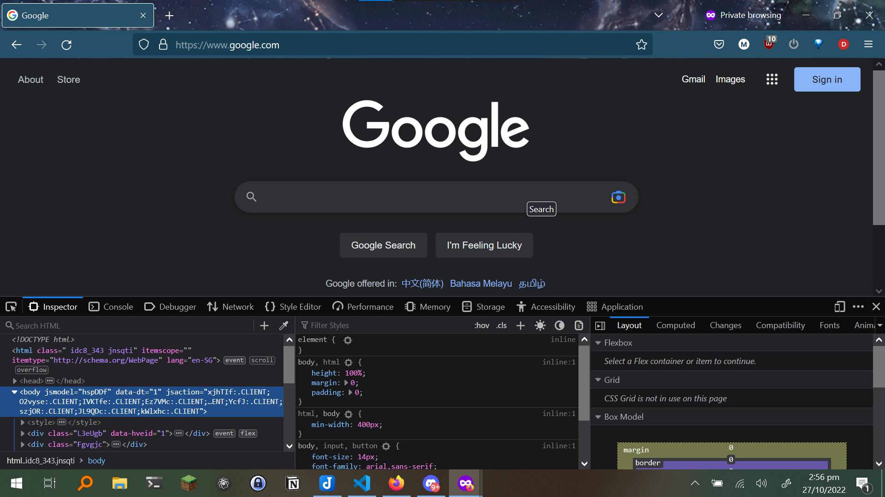

# **Chapter 1: Simple Web Exploitation**

## Introduction

Websites are the life blood of the internet. However, they are also not safe, and one can easily use exploits in them. In this Chapter, we will show some introductory exploits can be used in CTFs for Web Sections and that could be done on a potential website you make. Note that you should not perform these exploits on real websites without permission.

## HTML, CSS, and JavaScript

HTML, CSS, and JavaScript are the three main languages used in web development. HTML is used to create the structure of the website, CSS is used to style the website, and JavaScript is a scripting language that is used to add interactivity to the website. JavaScript can be used to exploit vulnerabilities in website.

## Dev Tools

Pressing Ctrl + Shift + I will allow you to see the Dev Tools of your browser

*Firefox Dev Tools*

One can see multiple tabs, with most of them being useful in someway for CTFs. As a result, we will go through some of them and how they can be used.

### Inspector

The Inspector menu allows one to see the HTML and CSS (and JS in script tags) of the webpage you are at. An extension of the HTML can be found in Page Source by pressing Ctrl + U. Both of these will allow us to find any hidden flags in the HTML, which could be in the comments. Comments could also contain hints to solve challenges. It will also allow us to find any hidden elements or links that could possibly lead to more vulnerabilities. Seeing the source or directory path of the link itself can reveal information regarding the directory structure of the website. This can be used to find hidden directories or files that could contain flags. Inspecting elements can save a lot of time in understanding what and how it's displaying what it is and can also a great way to zero in sections of code.

*[Example of flag in Page Source](https://ctfacademy.github.io/web/challenge1/index.htm)*

### Debugger / Sources

*Firefox Debugger*

The debugger allows developers to debug their JavaScript code, but it also allows us to see the JavaScript code of the website we are at. This can be useful in finding any hidden flags in the JavaScript code, or even finding any vulnerabilities in the JavaScript code. Most of the times, the JS code in the debugger will be compact, to save space. As a result, there is normally a Pretty print button at the bottom of the debugger, which looks like two curly braces. This will allow you to see the code in a more readable format.

*Breakpoint in Debugger*

If you click on a line of code, it will turn blue. This is a breakpoint, which will stop the code from running at that line. If you press the play button, the code will run until it reaches the breakpoint, where it will stop and also allow you to see any defined variables and its values. If you press the play button again, the code will run until it reaches the next breakpoint. This is useful for finding any bugs in the code.

### Console

The console allows someone to write custom JavaScript code to run on the webpage and can be used a lot for scripting, such as to break password hashes. It is really important to run JavaScript for this purpose and [MDN](https://developer.mozilla.org/en-US/) is a good resource to learn some basic JavaScript. Using breakpoints and the console together can allow us to edit certain variables, or run other custom code in between the code running in the websites JavaScript code.

### Network

The Network tab allows us to see all the external requests made by a webpage. Each row represents a resource which was requested. The status column shows the [HTTP response code](https://developer.mozilla.org/en-US/docs/Web/HTTP/Status), the initiator column shows what requested the resource. Clicking on the row can show us the [HTTP request](https://www.ibm.com/docs/en/cics-ts/5.3?topic=protocol-http-requests) of it, which can be edited in Firefox only. This can be used while doing forms to change where the form results are sent (form endpoints). You can also write new requests. By right clicking on a row, you can copy the request as a [cURL](https://developer.ibm.com/articles/what-is-curl-command/) command or [fetch](https://developer.mozilla.org/en-US/docs/Web/API/Fetch_API/Using_Fetch) method, which can be used in the terminal or console respectively to send requests.

[Here](https://youtu.be/3W65ji1gc8c?t=994) is a good video for more in-depth information on the Dev Tools.

## Directory Traversal

### How do URLs work?

A URL is an address to a certain resource. This resource can be a HTML page, image and other files. The anatomy of a URL is important to understand, especially to learn about directory traversal.

Read this [this guide](https://developer.mozilla.org/en-US/docs/Learn/Common_questions/What_is_a_URL) on URL anatomy.

### Path and Parameters

The most important part of URLs is the path. The path is the part of the URL that comes after the domain name and shows the path to a certain resource in a web server, which are mainly Linux servers. The path can sometimes also be specified in parameters, which are key-value pairs. The path can be edited by user input and if it isn't properly sanitized or properly sandboxed, it could be vulnerable to directory traversal. In directory traversal, the path is used to traverse the directory structure of the web server. This can be used to find hidden files and directories, which could contain flags. Usually, HTML files are stored in `/var/www/html`, but this can be different depending on the web server. We can navigate through the directory using relative paths. `./` represents are current directory. To go up this directory, we go to a parent directory, which is called `../` as a relative path. We can continuously do this until we reach the root directory, which is `/`, where all files of the server are stored and from where we can navigate to any directory.

Some important files to possible check is the `/etc/shadow` file, which contains the password hashes of all the users on the server. This can be used to [break the password hashes](https://null-byte.wonderhowto.com/how-to/crack-shadow-hashes-after-getting-root-linux-system-0186386/) and gain access to the server. Another important file is the `/etc/passwd` file, which contains the usernames and passwords of all the users on the server.

Let us look at an [example](https://vm-thijs.ewi.utwente.nl/ctf/traversal.asp?page=index.html),  

We can see a path parameter in the URL, with the value of `index.html`. To check if it is susceptible to directory traversal, we can try to navigate to the parent directory by changing the value to `../`.

It worked! We can now navigate to any directory we want. Now try to see if you can get the flag!

### Cookies

Cookies, which are in the [Storage tab](https://firefox-source-docs.mozilla.org/devtools-user/storage_inspector/), can also reference certain directories, which can be exploited by doing a Directory Traversal attack as shown above. This can be done by changing the value of the cookie to a path that you want to navigate to.

Read this [chapter](https://owasp.org/www-community/attacks/Path_Traversal) by OWASP on Directory Traversal to get more examples and find out ways to prevent it.\
If you want to go more in-depth and also want to learn about BurpSuite, read this [guide](https://portswigger.net/web-security/file-path-traversal) by PortSwigger.

## Command Injection

Command injection is an attack where arbitrary commands are executed on the host Operating System through a vulnerability. This is possible when the website passes user input to a command interpreter without properly sanitizing it. However, the severity of this attack is dependent on the privileges of the user. As most web servers use Linux or Windows as its OS, it is favourable to learn some [Linux commands](https://ubuntu.com/tutorials/command-line-for-beginners#1-overview) and also some [Windows commands](https://learn.microsoft.com/en-us/windows-server/administration/windows-commands/windows-commands).

How do we detect if command injection is possible? Let us use `https://website/endpoint?parameter=123` as a generic URL

We can insert special characters to see if the application blocks anything that could be used for command injection, such as `&`, `;`, `|`. It no error is given, we can try to put our own commands in after the delimiter: `https://website/endpoint?parameter=1|whoami`.\
`whoami` is a command in both Linux and Windows, and outputs the username of the user. However, most of the times, command injection is blind and does not give any output. For that we can try to put a time delay, such as `https://vulnerable-website/endpoint?parameter=x||ping+-c+10+127.0.0.1||`. This will ping the localhost 10 times, which will take 10 seconds. If the website takes more than 10 seconds to load, we can assume that command injection is possible.

There are even more methods to do command injection, such as file upload.
Read this [chapter](https://owasp.org/www-community/attacks/Command_Injection) by OWASP, this [guide](https://portswigger.net/web-security/os-command-injection) by PortSwigger and this [tutorial](https://book.hacktricks.xyz/pentesting-web/command-injection). If you prefer videos, this [video](https://www.youtube.com/watch?v=UBWMLFbjPBc) is very helpful, with [this](https://www.youtube.com/watch?v=9XY2abdWADQ) being more in-depth.

## SQL Injection

SQL injection is an attack where a user can inject SQL code into a database query. This can be done by using special characters in the input, such as `'`, `"` and `;`. This can be used to retrieve data from the database, which can be used to gain access to the website via the use of `SELECT` statement, which is used to retrieve data from a database. Some knowledge of SQL is needed to learn about SQL injection. [This](https://www.sqltutorial.org/) is a good SQL tutorial.

Try studying SQL Injection yourself. Don't worry, we will provide you with some good resources to learn about it:

* [Simple SQL Injection tutorial](https://vm-thijs.ewi.utwente.nl/ctf/sql)
* [SQL tutorial with challenges](https://portswigger.net/web-security/sql-injection)
* [In-depth SQL tutorial](https://book.hacktricks.xyz/pentesting-web/sql-injection)
* [SQL Injection Cheat Sheet](https://www.invicti.com/blog/web-security/sql-injection-cheat-sheet/#InlineSamples)
* [SQL Injection Practical and Theory](https://www.youtube.com/watch?v=fiq59DuhY68)
* [SQL Injection Theory](https://www.youtube.com/watch?v=1nJgupaUPEQ)
* [Automatic SQL Injection](https://sqlmap.org/)

## Questions

Go to these sites and try some questions. Do not be discouraged if you cannot solve them, as it is a learning process. If you do not understand something, such as what is cuRL, do not be afraid to google and learn new things. If you are stuck, try to look as the hints, but even after that you are still stuck, search online for writeups for the problem. [This](https://www.hackthebox.com/blog/It-is-Okay-to-Use-Writeups) is a good article on why it is okay to use writeups.

* [PicoGym Web](https://play.picoctf.org/practice?category=1&page=1)
* [Root Me Web Client](https://www.root-me.org/en/Challenges/Web-Client/)
* [Hacker101 CTF](https://ctf.hacker101.com/)
* [HackThisSite (Try Basic, Realistic and JavaScript)](https://www.hackthissite.org/)
* [OverTheWire Natas](https://overthewire.org/wargames/natas/)

## Additional Resources

* [Command Injection Cheat Sheet](https://gabb4r.gitbook.io/oscp-notes/cheatsheet/command-injection-cheatsheet)
* [CTF Checklist](https://fareedfauzi.gitbook.io/ctf-checklist-for-beginner/web)
* [List of useful payloads](https://github.com/swisskyrepo/PayloadsAllTheThings)
* [Hash payloads](https://github.com/danielmiessler/SecLists)
* [wechall.net](https://www.wechall.net/active_sites)
* [wechall challenges](https://www.wechall.net/challs/)
